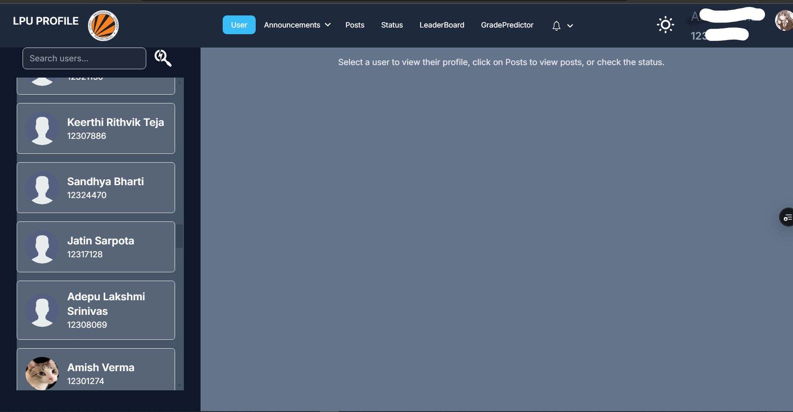
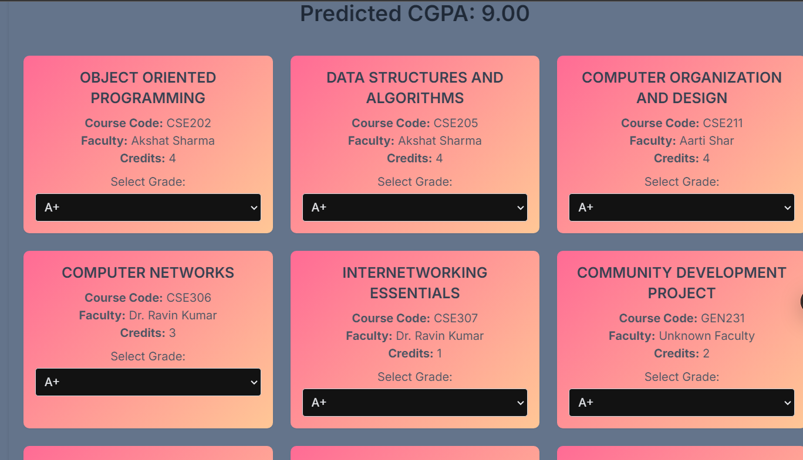
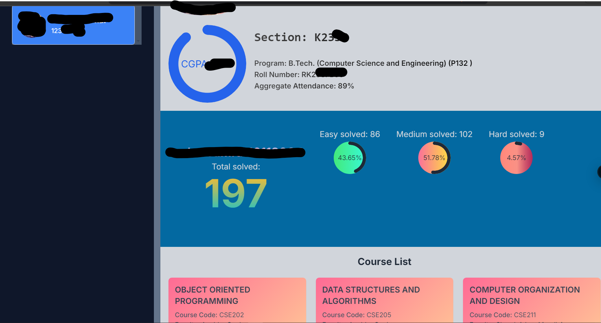
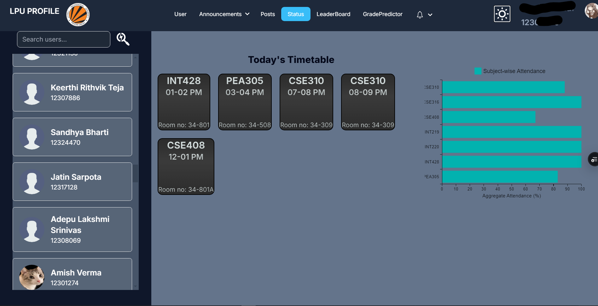

# LPU Profile

**LPU Profile** is a web platform designed to enhance the academic and social experience of LPU students. It allows students to log in using their **LPU UMS credentials** and access various features like grade prediction, faculty details, and subject credits. It also offers customizable profiles, community chat, and leaderboard functionality to foster a peer-connected learning environment.

---

## Features

### 🔑 Login with LPU UMS Credentials

- Directly log in using your **LPU UMS credentials**.
- Access personal academic information securely.

### 🎯 Grade Predictor

- Calculate your probable grade using the **grade predictor tool**.
- Plan your studies based on predicted grades.

### 📚 Academic Insights

- View faculty details, subjects, and subject credits.
- Stay organized with all your academic information in one place.

### 🌐 LinkedIn, Instagram, and GitHub Integration

- Customize your profile by linking your **LinkedIn**, **Instagram**, and **GitHub** accounts.
- Showcase your progress and skills to your peers.

### 📈 CGPA and Leaderboard

- View your CGPA and track your academic progress.
- Compete with peers on the **leaderboard**.
- Option to **hide your CGPA** for privacy.

### 💬 Community Chat

- Post your doubts and interact with peers in the **community chat**.
- A space to learn, collaborate, and grow together.

### 🔗 LeetCode Account Linking

- Link your **LeetCode account** to showcase your coding journey and achievements.

### 🛠 Hosted on Render

- **Note**: Since the website is hosted on Render, the server might take some time to spin up after being idle. If you face issues logging in, wait for a few moments and try again.

---

## Getting Started

### Prerequisites

- An **LPU UMS account** for login.

### Usage

1. Visit the website: **[LPU Profile](https://lpuprofile.vercel.app/)**
2. Log in using your LPU UMS credentials.
3. Explore features like grade prediction, profile customization, community chat, and leaderboard.

---

## Screenshots

### Home Page

### Grade Predictor

### Profile

### Status

---

## Contributing

We welcome contributions! If you’d like to contribute:

1. Fork the repository.
2. Create a feature branch: `git checkout -b feature/your-feature`.
3. Commit your changes: `git commit -m 'Add some feature'`.
4. Push to the branch: `git push origin feature/your-feature`.
5. Open a pull request.

---

## License

This project is licensed under the **MIT License**. See the `LICENSE` file for more details.

---

## Acknowledgements

Special thanks to the LPU student community for inspiring the creation of this platform. Let's connect, learn, and grow together!
